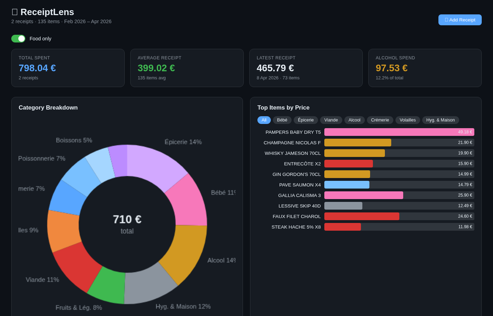
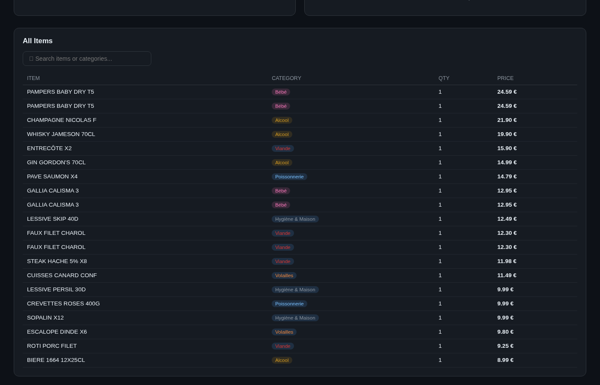
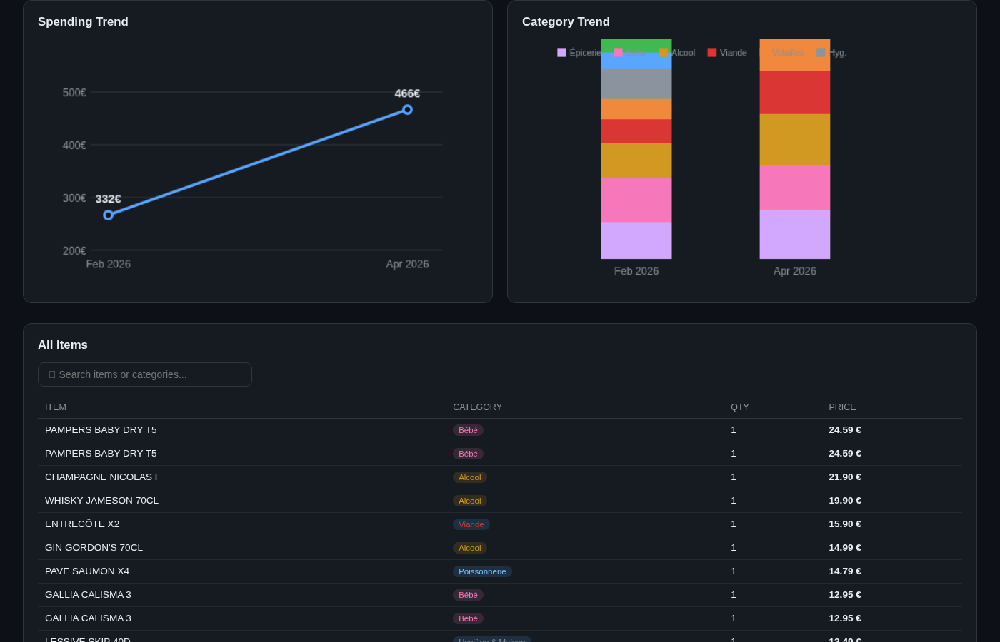

# 🧾 ReceiptLens

A visual grocery receipt analyser that runs entirely in your browser. Drop a scanned PDF from **E.Leclerc** and instantly see where your money goes — no server, no upload, no account.



---

## Features

**In-browser OCR** — Tesseract.js reads scanned receipt PDFs directly in the browser. Nothing leaves your machine.

**Smart categorisation** — Items are automatically sorted into categories: Bébé, Fruits & Légumes, Viande, Volailles, Charcuterie, Poissonnerie, Crémerie, Épicerie, Boissons, Alcool, Hygiène & Maison.

**Visual breakdown** — Donut chart shows category split at a glance. Click any slice to drill down.



**Top items explorer** — See your most expensive items overall or filter by category. Expand to reveal the full list.

**Food-only mode** — Toggle to exclude Hygiène & Maison and focus on food spend only.

**Alcohol tracking** — Dedicated card tracks alcohol spend with percentage of total.

**Trend tracking** — Load multiple receipts and watch how each category evolves over time.



**Fuzzy search** — Find any item instantly with typo-tolerant search across names and categories.

**Persistent storage** — Receipts are saved in localStorage so they survive page reloads.

**Single file** — The entire app is one `index.html`. No build step, no dependencies to install.

---

## Quick start

```bash
# Clone and serve locally (OCR needs HTTP, not file://)
git clone https://github.com/Lowess/receipt-lens.git
cd receipt-lens
./serve.sh
# Open http://localhost:8001
```

Then click **Add Receipt**, pick a scanned E.Leclerc PDF, and wait for OCR to finish.

---

## Deploy to GitHub Pages

```bash
# First time — creates the repo and enables Pages
./deploy.sh --init

# Subsequent deploys
./deploy.sh "Add new feature"
```

Your app will be live at `https://Lowess.github.io/receipt-lens`.

---

## Tech stack

| Layer | Library |
|-------|---------|
| OCR | [Tesseract.js v5](https://github.com/naptha/tesseract.js) |
| PDF rendering | [PDF.js 3.11](https://mozilla.github.io/pdf.js/) |
| Charts | [Chart.js 4](https://www.chartjs.org/) |
| Hosting | GitHub Pages (static) |

Everything loads from CDN — zero build tooling required.

---

## License

MIT
